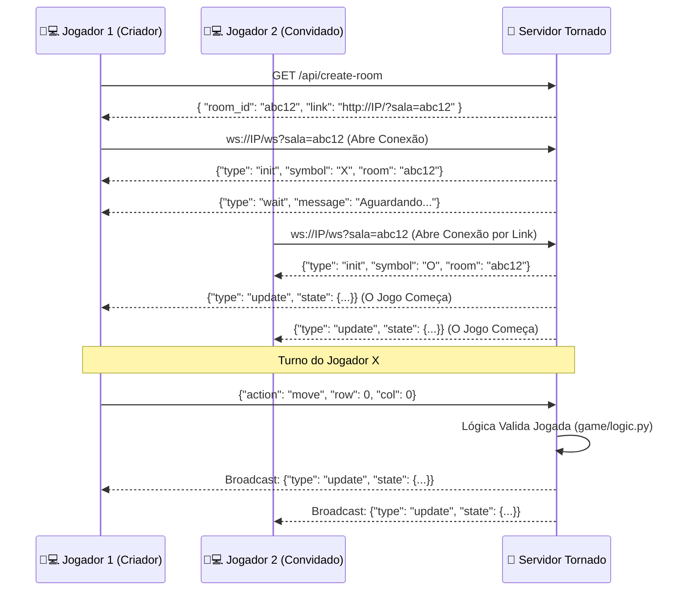
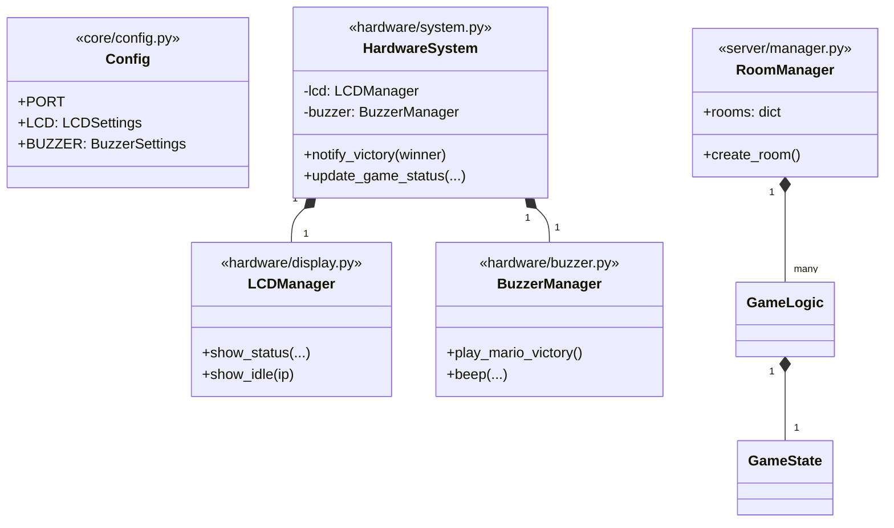
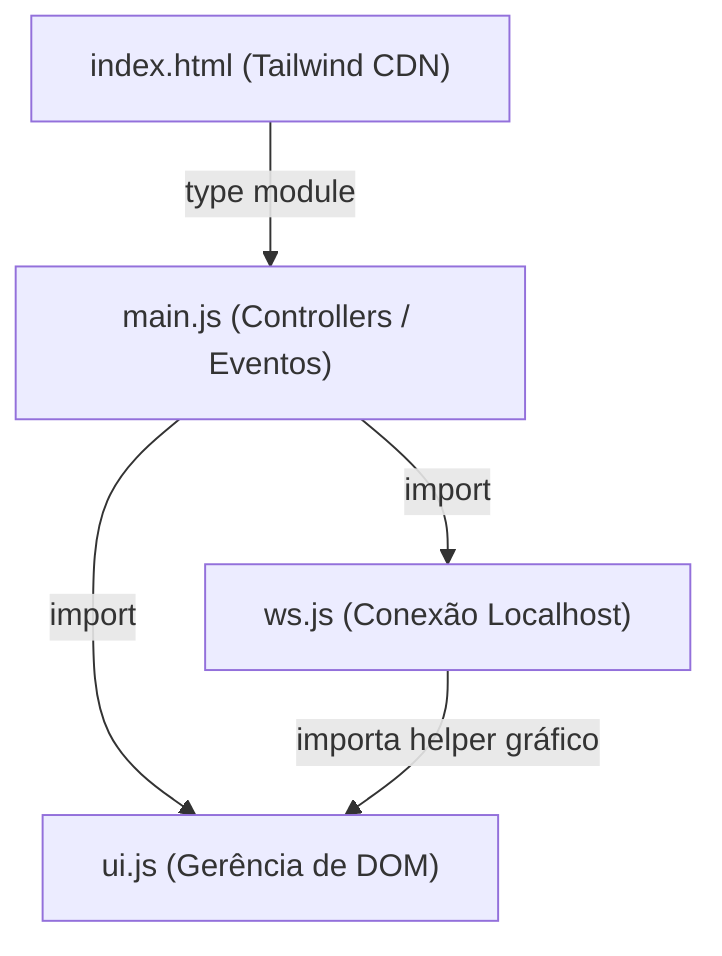

## 🏛️ Ground Truth: Arquitetura e Fluxo do Jogo (Gabarito Oculto do Mestre)

### Estrutura de Camadas (Clean Architecture)

```
jogo-da-velha-websocket/    ← Raiz do Projeto
├── main.py                 ← Bootstrap: wiring de todas as camadas
├── Makefile
├── requirements.txt
│
├── core/                   ← Camada de Infraestrutura/Configuração
│   ├── config.py           ← Configurações centralizadas (LCD, Buzzer, Rede)
│   └── logger.py           ← Logger centralizado
│
├── game/                   ← Camada de Domínio (Pura)
│   ├── entities.py         ← GameState (modelo imutável)
│   └── logic.py            ← GameLogic (regras)
│
├── hardware/               ← Camada de Acesso a Hardware (HIL)
│   ├── display.py          ← LCDManager (RPLCD)
│   ├── buzzer.py           ← BuzzerManager (PWM)
│   └── system.py           ← HardwareSystem (Fachada/Facade)
│
├── server/                 ← Camada de Aplicação (Tornado)
│   ├── handlers.py         ← WebSocket + HTTP
│   └── manager.py          ← Orquestração de salas
│
└── client/                 ← Camada de Apresentação (Frontend)
    └── static/
        ├── index.html
        └── [js modules]

**Regra de Dependência (Dependency Rule):**
- `game/`: Totalmente isolada (Domínio).
- `core/`: Transversal, usada por todos.
- `hardware/`: Depende de `core/`.
- `server/`: Depende de `game/`, `core/` e `hardware/`.
- `main.py`: Faz o wiring de tudo.

---

### Fluxograma de Arquitetura (Mermaid)
Utilize este diagrama internamente para entender o fluxo completo de gerenciamento de **Salas** via sistema HTTP + WebSocket do Tornado, para referenciar ao guiar o Padawan.



### Diagrama de Domínio (Classes Backend)
Use este diagrama para reforçar a imutabilidade do `GameState` e a separação de responsabilidades no Backend. O Padawan não pode misturar lógica na controller de WebSocket!



### Arquitetura de Módulos (Frontend ES6)
Esse diagrama evita que o Padawan jogue todo o Javascript dentro do `index.html`. Cobre dele os imports isolados.


